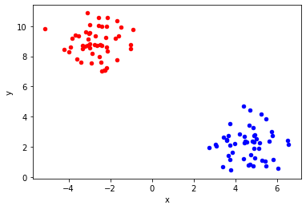

# Generating Data - Lab

## Introduction

In this lab, we shall practice some of the data generation techniques that we saw in earlier lesson to generate datasets for regression and classification purposes. We shall run a couple of simple simulations to help us generate different dataset by controlling noise and variance parameters in the data generation process. We shall look at the statistical indicators and visual output to see how these parameters affect the accuracy of an algorithm. 

## Objectives
You will be able to:

- Generate datasets for classification problems
- Generate datasets for regression problems

## Task 1

Use `make_blobs()` to create a binary classification dataset with 100 samples, 2 features, and 2 centers (where each center corresponds to a different class label). Set `random_state = 42` for reproducibility.

_Hint: Here's a link to the documentation for_ [`make_blobs()`](https://scikit-learn.org/stable/modules/generated/sklearn.datasets.make_blobs.html).


```python
# your code here 

# import relevant libraries 
```


```python
# __SOLUTION__

# import relevant libraries
import pandas as pd 
from sklearn.datasets import make_blobs

X, y = make_blobs(n_samples=100, centers=2, n_features=2, random_state=42)
```

Place the data in a `pandas DataFrame` called `df`, and inspect the first five rows of the data. 

_Hint: Your dataframe should have three columns in total, two for the features and one for the class label._ 


```python
# your code here 
```


```python
# __SOLUTION__
df = pd.DataFrame(dict(x=X[:, 0], y=X[:, 1], label=y))
df.head()
```


<div>
<style scoped>
    .dataframe tbody tr th:only-of-type {
        vertical-align: middle;
    }

    .dataframe tbody tr th {
        vertical-align: top;
    }

    .dataframe thead th {
        text-align: right;
    }
</style>
<table border="1" class="dataframe">
  <thead>
    <tr style="text-align: right;">
      <th></th>
      <th>x</th>
      <th>y</th>
      <th>label</th>
    </tr>
  </thead>
  <tbody>
    <tr>
      <th>0</th>
      <td>-2.988372</td>
      <td>8.828627</td>
      <td>0</td>
    </tr>
    <tr>
      <th>1</th>
      <td>5.722930</td>
      <td>3.026972</td>
      <td>1</td>
    </tr>
    <tr>
      <th>2</th>
      <td>-3.053580</td>
      <td>9.125209</td>
      <td>0</td>
    </tr>
    <tr>
      <th>3</th>
      <td>5.461939</td>
      <td>3.869963</td>
      <td>1</td>
    </tr>
    <tr>
      <th>4</th>
      <td>4.867339</td>
      <td>3.280312</td>
      <td>1</td>
    </tr>
  </tbody>
</table>
</div>


Create a scatter plot of the data, while color-coding the different classes.

_Hint: You may find this dictionary mapping class labels to colors useful: 
`colors = {0: 'red', 1: 'blue'}`_


```python
# your code here 

# import relevant libraries 
```


```python
# __SOLUTION__

# import relevant libraries
import matplotlib.pyplot as plt 
%matplotlib inline 

colors = {0: 'red', 1: 'blue'}

fig, ax = plt.subplots()
grouped = df.groupby('label')

for key, group in grouped:
    group.plot(ax=ax,kind='scatter', x ='x', y='y', label=key, color=colors[key])
```





Repeat this exercise two times by setting `cluster_std = 0.5` and `cluster_std = 2`. 

Keep all other parameters passed to `make_blobs` equal. 

That is:
* Create a classification dataset with 100 samples, 2 features, and 2 centers using `make_blobs`. 
    * Set `random_state = 42` for reproducibility, and pass the appropriate value for `cluster_std`. 
* Place the data in a `pandas DataFrame` called `df`. 
* Plot the values on a scatter plot, while color-coding the different classes.

What is the effect of changing `cluster_std`, based on your plots? 


```python
# Your code here: 
# cluster_std = 0.5
```


```python
# Your code here: 
# clusted_std = 2
```


```python
# __SOLUTION__

X, y = make_blobs(n_samples=200, centers=2, n_features=2, cluster_std=0.5, random_state=42)
df = pd.DataFrame(dict(x=X[:, 0],  y=X[:, 1], label=y))
colors = {0: 'red', 1: 'blue'}

fig, ax = plt.subplots()
grouped = df.groupby('label')

for key, group in grouped:
    group.plot(ax=ax,kind='scatter', x ='x', y='y', label=key, color=colors[key])
```


```python
# __SOLUTION__

X, y = make_blobs(n_samples=200, centers=2, n_features=2, cluster_std=2, random_state=42)
df = pd.DataFrame(dict(x=X[:, 0],  y=X[:, 1], label=y))
colors = {0: 'red', 1: 'blue'}

fig, ax = plt.subplots()
grouped = df.groupby('label')

for key, group in grouped:
    group.plot(ax=ax,kind='scatter', x ='x', y='y', label=key, color=colors[key])
```


```python
# Your answer here 
```


```python
# __SOLUTION__

# When setting `cluster_std = 0.5` and keeping all other parameters the same, 
# we obtain two different clusters centered at the same positions as beforehand, 
# but the points in each cluster are closer to the centers of the clusters. 
# 
# When setting `cluster_std = 2` and keeping all other parameters equal, 
# we obtain two different clusters centers at the same positions as beforehand,
# but more spread out about the centers of the clusters. 
# 
# `cluster_std` controls the spread of the data about the center of the clusters 
# we've created. 
```

## Task 2

Create a function `reg_simulation()` to run a regression simulation creating a number of datasets with the `make_regression()` data generation function. Perform the following tasks:

* Create `reg_simulation()` with `n` (noise) and `random_state` as input parameters
    * Make a regression dataset (X,y) with 100 samples using a given noise value and random state
    * Plot the data as a scatter plot 
    * Calculate and plot a regression line on the plot and calculate $R^2$ (you can do this in statsmodels or sklearn)
    * Label the plot with the noise value and the calculated $R^2$.
    
* Pass a fixed random state and values from `[10, 25, 40, 50, 100, 200]` as noise values iteratively to the function above. 
* Inspect and comment on the output.


```python
# import necessary libraries


def reg_simulation(n, random_state):
    
    # Generate X and y

    # Use X,y to draw a scatter plot
    # Fit a linear regression model to X , y and calculate r2
    # label and plot the regression line 
    pass


random_state = random_state = np.random.RandomState(42)

for n in [10, 25, 40, 50, 100, 200]:
    reg_simulation(n, random_state)
```


```python
# __SOLUTION__ 

import matplotlib.pyplot as plt
%matplotlib inline
from sklearn.datasets import make_regression
from sklearn.linear_model import LinearRegression
import numpy as np

def reg_simulation(n, random_state):
    X, y = make_regression(n_samples=100, n_features=1, noise=n, random_state=random_state)

    plt.scatter(X[:, 0], y, color="red", s=10, label="Data")

    reg = LinearRegression().fit(X, y)
    plt.plot(X[:, 0], reg.predict(X), color="black", label="Model")
    plt.title("Noise: " +str (n)+ ", R-Squared: " + str(round(reg.score(X,y), 2)))
    plt.tick_params(labelbottom=False, labelleft=False)
    plt.xlabel("Variable X")
    plt.ylabel("Variable Y")
    plt.legend()
    plt.show()

random_state = np.random.RandomState(42)


for n in [10, 25, 40, 50, 100, 200]:
    reg_simulation(n, random_state)
```


```python
# Your comments here
```


```python
# __SOLUTION__ 

# As the noise level increases, the coefficient of determination of our model fit decreases. 
```

## Summary 

In this lesson, we learned how to generate random datasets for classification and regression contexts. We ran simulations for this and fitted simple models to view the effect of random data parameters including noise level and std on the performance of parameters, visually as well as objectively. These skills will come in handy while testing model performance and robustness in future. 
